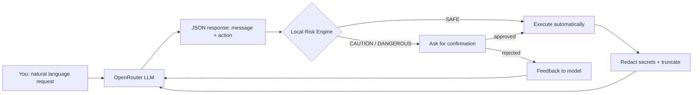

<div align="center">

# 🤖 Linux Autopilot Agent

**An interactive AI agent for Linux system administration, debugging and automation — powered by OpenRouter.**

[](https://www.python.org/downloads/)
[](LICENSE)
[](#-features)
[](#-requirements)
[](CONTRIBUTING.md)

*Speak to your Linux machine in natural language. The agent runs safe commands automatically and asks for confirmation only when it matters.*

</div>

---

## 📖 Table of Contents

- [What is it?](#-what-is-it)
- [Features](#-features)
- [How it works](#-how-it-works)
- [Requirements](#-requirements)
- [Installation](#-installation)
- [Quick Start](#-quick-start)
- [Usage](#-usage)
  - [Interactive mode](#interactive-mode)
  - [One-shot mode](#one-shot-mode)
  - [Command-line options](#command-line-options)
  - [Environment variables](#environment-variables)
- [Safety Model](#-safety-model)
- [Interactive Commands](#-interactive-commands)
- [Examples](#-examples)
- [Project Structure](#-project-structure)
- [Contributing](#-contributing)
- [License](#-license)

---

## 🧠 What is it?

**Linux Autopilot Agent** is a terminal-based AI assistant that helps you administer, debug and automate a Linux system (including Raspberry Pi) using natural language. It connects to [OpenRouter](https://openrouter.ai) to access a wide range of LLMs, and executes shell commands on your behalf.

Unlike naive "AI shell" wrappers, this agent uses a **structured JSON protocol** between the model and the shell — no fragile parsing of ```bash``` code blocks. Every command is classified by a **local, model-independent risk engine** before execution.

> **Key idea:** the LLM proposes, the local engine decides. The model never has the final word on whether a command is safe.

---

## ✨ Features

- 🗣️ **Natural language control** — describe what you want, in plain English.
- 🛡️ **Local risk engine** — commands are classified as `SAFE`, `CAUTION` or `DANGEROUS` by regex rules that run locally, independent of the model.
- ✅ **Auto-execution of safe commands** — read-only and harmless operations run without asking.
- ⚠️ **Interactive confirmation** — only for destructive, privileged, network, system or potentially exfiltrating operations.
- 🔒 **Secret redaction** — API keys, tokens, passwords and private keys are scrubbed from output before it reaches the model.
- 📦 **Zero dependencies** — pure Python standard library, no `pip install` needed.
- 🔄 **Streaming responses** — see the model's reasoning and output in real time.
- 💾 **Persistent history** — your requests are saved to `history.json` next to the script.
- 🧩 **Multi-model support** — switch models on the fly with `:model`.
- 🤖 **Autopilot mode** — run everything without confirmation (use with care).
- 🎨 **Colored terminal UI** — with a `--no-color` option for scripts and CI.

---

## ⚙️ How it works



1. You type a request in natural language.
2. The agent sends it (with your local system context) to an OpenRouter model.
3. The model replies with a **single JSON object** describing a message and an optional shell action.
4. The **local risk engine** classifies the command.
5. Safe commands run automatically; risky ones ask for your confirmation.
6. The output is **redacted and truncated** before being sent back to the model as feedback.
7. The loop repeats until the task is done.

---

## 📋 Requirements

- **Linux** (or Raspberry Pi / any Unix-like system with `/bin/bash`)
- **Python 3.8+**
- An **OpenRouter API key** (free to create at [openrouter.ai](https://openrouter.ai))

No external Python packages are required.

---

## 🚀 Installation

```bash
# Clone the repository
git clone https://github.com/YOUR_USERNAME/linux-autopilot-agent.git
cd linux-autopilot-agent

# (Optional) make it executable
chmod +x linux_autopilot.py
```

That's it. No `pip install`, no virtual environment required.

---

## ⚡ Quick Start

```bash
# 1. Set your OpenRouter API key
export OPENROUTER_API_KEY='sk-or-v1-...'

# 2. Run interactively
python3 linux_autopilot.py

# Or run a one-shot task
python3 linux_autopilot.py "check why docker won't start"
```

---

## 🛠️ Usage

### Interactive mode

```bash
python3 linux_autopilot.py
```

You'll get a prompt where you can type requests in natural language and use the built-in commands (see [Interactive Commands](#-interactive-commands)).

### One-shot mode

```bash
python3 linux_autopilot.py "show me how much space the Docker directories take"
```

### Command-line options

| Option | Description | Default |
|--------|-------------|---------|
| `--model NAME` | OpenRouter model to use | `deepseek/deepseek-v4-flash-0731` |
| `--max-steps N` | Maximum number of steps per task | `25` |
| `--timeout N` | Command timeout in seconds | `600` |
| `--no-color` | Disable terminal colors | off |
| `--version` | Print the version and exit | — |

### Environment variables

| Variable | Description | Default |
|----------|-------------|---------|
| `OPENROUTER_API_KEY` | Your OpenRouter API key (**required**) | — |
| `AGENT_MODEL` | Default model | `deepseek/deepseek-v4-flash-0731` |
| `AGENT_MAX_STEPS` | Max steps per task | `25` |
| `AGENT_COMMAND_TIMEOUT` | Command timeout (seconds) | `600` |
| `AGENT_MAX_OUTPUT` | Max output chars sent to the model | `12000` |
| `AGENT_MAX_CONTEXT_MESSAGES` | Max conversation messages kept | `40` |
| `AGENT_MAX_COMMAND` | Max command length | `10000` |
| `AGENT_HTTP_REFERER` | Referer sent to OpenRouter | `https://github.com/linux-shell-agent` |
| `AGENT_X_TITLE` | Title sent to OpenRouter | `Linux Shell Autopilot` |
| `AGENT_NO_COLOR` | Disable colors (`1`/`true`/`yes`) | off |

---

## 🛡️ Safety Model

The safety of this agent is built on a **local, deterministic risk engine** that runs entirely on your machine. The LLM proposes commands, but **never decides** whether they are safe.

### Risk levels

| Level | Meaning | Behavior |
|-------|---------|----------|
| `SAFE` | Read-only or clearly harmless | Executed automatically |
| `CAUTION` | May modify the system, use privileges, touch the network or expose data | Asks for confirmation |
| `DANGEROUS` | Destructive, irreversible or high-risk | Always asks for confirmation |

### What triggers a warning

The engine checks for patterns such as:

- **Destructive operations**: `rm -rf`, `mkfs`, `fdisk`, `dd`, `wipefs`, `git reset --hard`
- **System changes**: `shutdown`, `reboot`, `systemctl stop`, package removal
- **Privilege escalation**: `sudo`, `passwd`, `userdel`
- **Network/exfiltration**: `ssh`, `scp`, `rsync`, `curl | bash`, sending credentials
- **Secret exposure**: reading `.env`, `/etc/shadow`, private keys, `env`
- **Indirect execution**: `eval`, `bash -c`, command substitution, `xargs`

### Secret redaction

Before any output is sent back to the model, the agent scrubs known secret patterns:

- `sk-...` (OpenAI-style keys)
- `ghp_...` and `github_pat_...` (GitHub tokens)
- `AKIA...` (AWS keys)
- `AIza...` (Google API keys)
- `Bearer <token>`
- `key=value` / `key: value` pairs for common secret names

### Autopilot mode

`:autopilot` disables all confirmations. **Use it only if you fully trust the model and know what you're doing.** It's designed for unattended automation where you accept the risk.

---

## ⌨️ Interactive Commands

| Command | Description |
|---------|-------------|
| `:help` | Show help |
| `:status` | Show configuration and current directory |
| `:clear` | Reset the conversation with the model |
| `:history` | Show saved requests |
| `:history clear` | Delete the persistent history |
| `:autopilot` | Toggle no-confirmation mode |
| `:model NAME` | Change the model in the session |
| `:cd PATH` | Change the working directory |
| `:quit` | Exit |

When the agent asks for confirmation:

| Key | Meaning |
|-----|---------|
| `Enter` / `Y` | Execute |
| `a` | Authorize similar operations for this request |
| `n` | No, do not execute |
| `d` | Details on why confirmation is needed |

---

## 💡 Examples

```bash
# Diagnose a failing container
python3 linux_autopilot.py "check why the immich_server container is in error"

# Inspect disk usage
python3 linux_autopilot.py "show me how much space the Docker directories take"

# Find a configuration
python3 linux_autopilot.py "find the file that contains that configuration"

# Check a service
python3 linux_autopilot.py "verify if nginx is active"

# Fix and verify
python3 linux_autopilot.py "fix the configuration and check that the service restarts"
```

---

## 📁 Project Structure

```
linux-autopilot-agent/
├── linux_autopilot.py   # The entire agent (single-file, zero dependencies)
├── README.md            # This file
├── LICENSE              # MIT License
├── CONTRIBUTING.md      # Contribution guidelines
└── .gitignore           # Git ignore rules
```

---

## 🤝 Contributing

Contributions are welcome! Please read the [CONTRIBUTING.md](CONTRIBUTING.md) for guidelines.

---

## 📄 License

This project is licensed under the **MIT License** — see the [LICENSE](LICENSE) file for details.

---

<div align="center">

**Made with ❤️ for the Linux community.**

⭐ If you find this useful, please consider giving it a star!

</div>